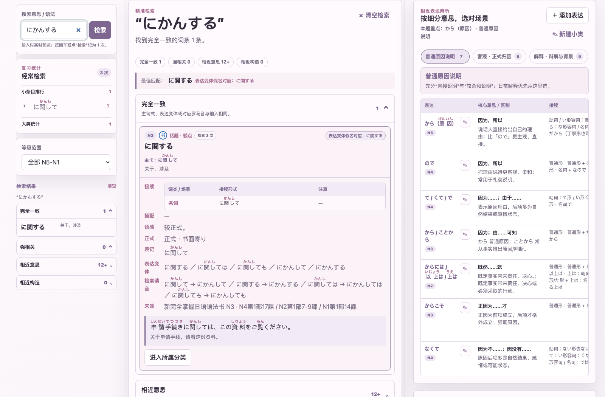
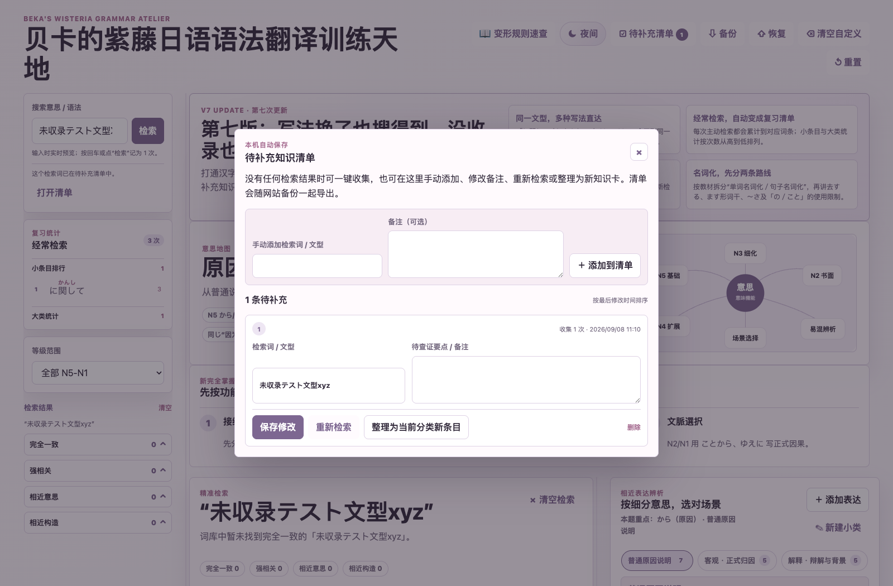
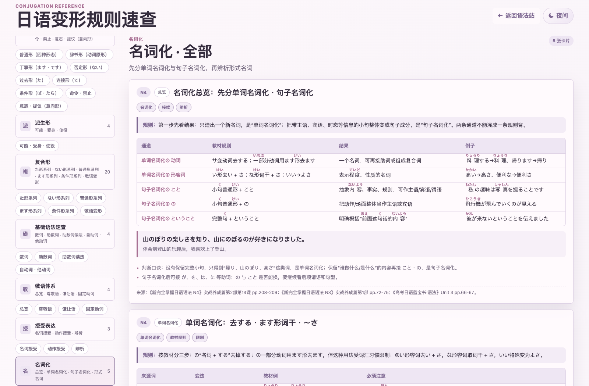
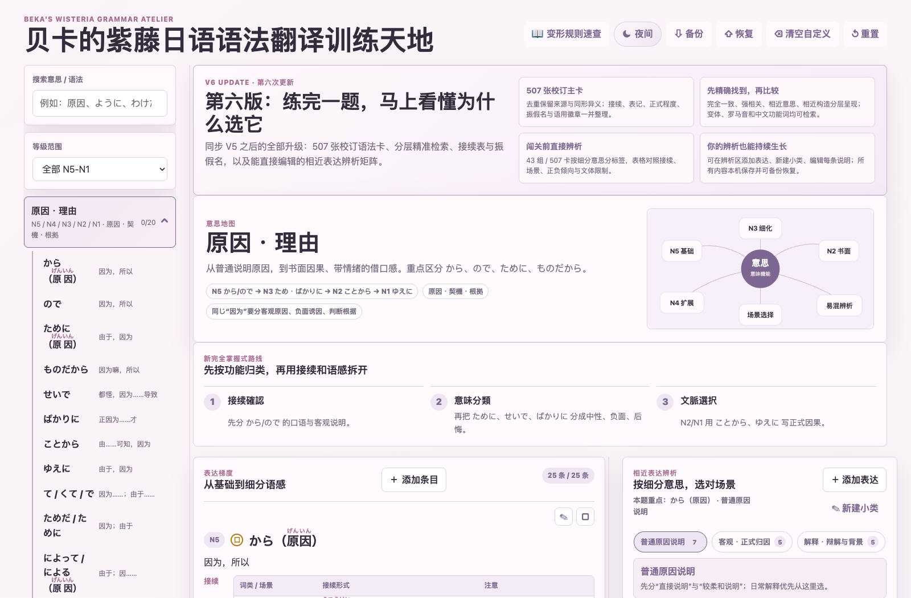
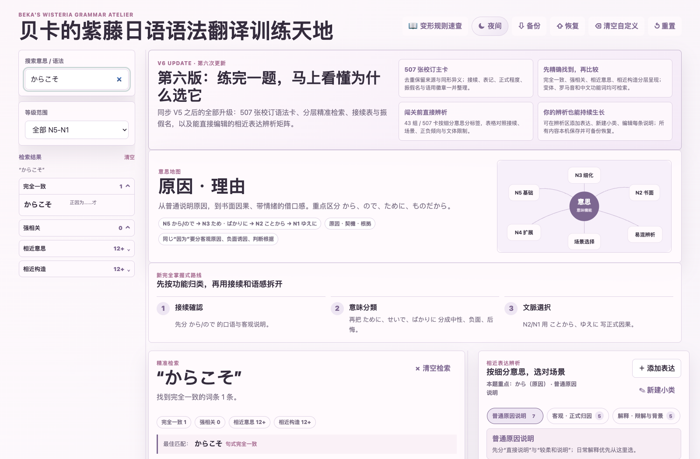
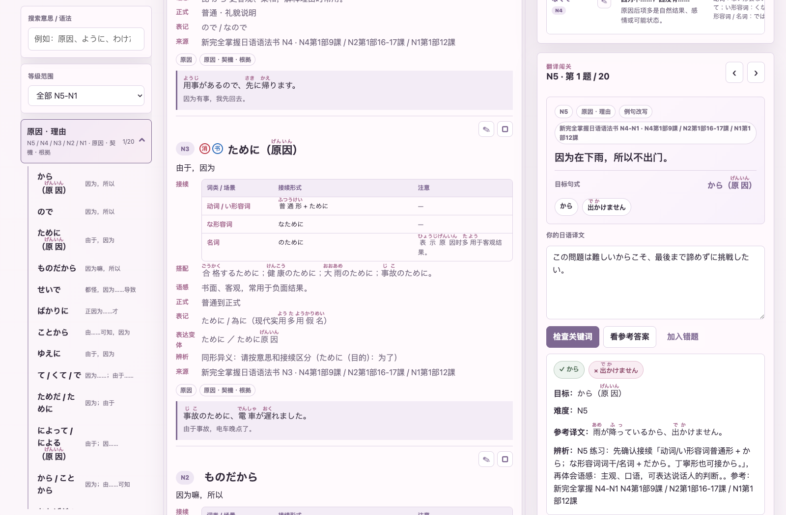
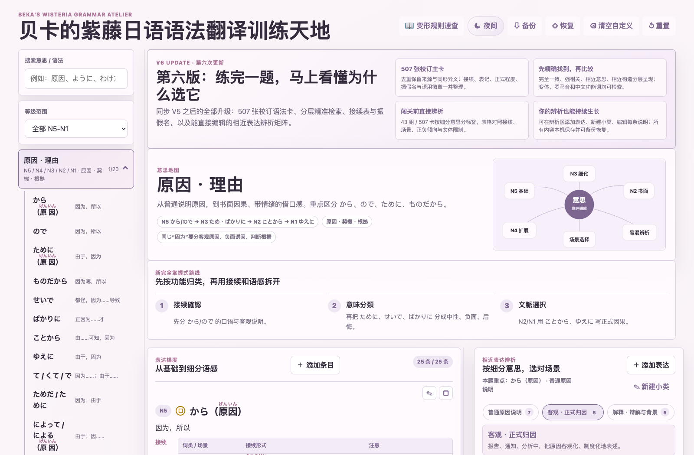
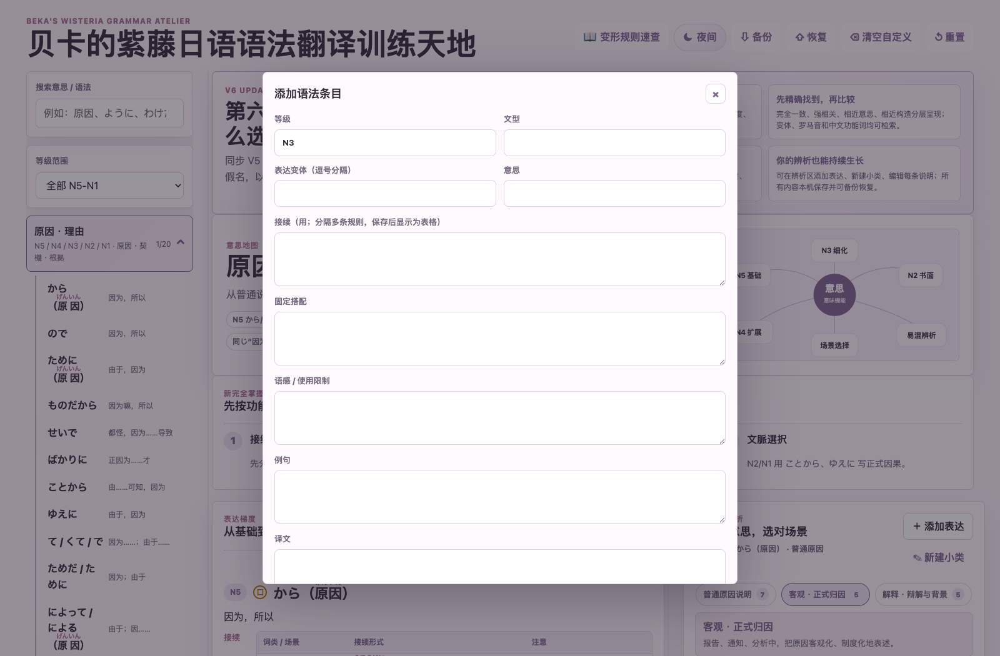
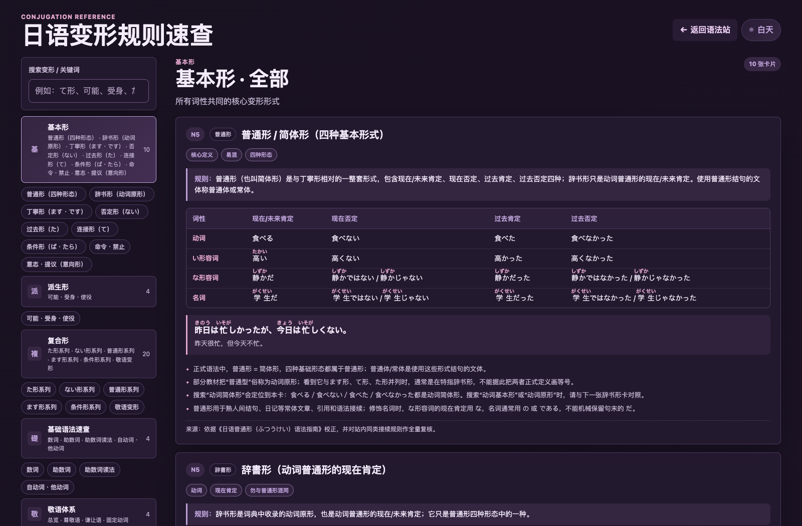

# 贝卡的紫藤日语语法翻译训练天地

这是一个可直接通过 GitHub Pages 托管的静态日语学习网站，包含语法知识卡、翻译练习、活用练习与本机学习记录。

## 第七次更新：写法换了也搜得到，没收录也不会丢

### 汉字、假名、罗马音与表达变体互通

- 同一语法的汉字、平假名、罗马音、て形、连体形和常见书面变体会回到同一张主卡。
- 例如 `に関して / に関する / にかんして / にかんする / ni kanshite / ni kansuru` 均可定位到同一卡片。
- 当前语法库为 **43 组、507 张主卡、760 个登记变体**；另为 107 张含汉字表达的卡片生成逐卡读音索引，覆盖 152 个汉字表达。




### 检索次数与经常检索清单

- 每次按回车或点击“检索”，都会为最佳匹配词条增加一次检索记录；同一查询重复主动提交也会继续累计。
- 卡片直接显示“检索 N 次”；左侧按小条目与大类分别累计、从高到低排序，方便定向复习。
- 实时输入只预览、不计数，避免普通输入过程污染统计；记录随网站备份一起导出和恢复。

### 待补充知识清单

- 没有完全一致、强相关或语义相关结果时，搜索框下会出现“添加到待补充知识清单”。
- 清单支持手动添加、修改备注、自动去重、重新检索、删除，以及整理成当前分类的新知识卡。
- 清单只保存在本机；转为新条目后会自动移出清单，并立即进入站内检索。



### 名词化按教材重新整理

- 先分“单词名词化”和“句子名词化”，再讲形式名词，避免把构词和整句包装混在一起。
- 单词名词化覆盖去 `する`、部分动词ます形词干、`い形去い＋さ`、`な形词干＋さ`、`いい→よさ`。
- 句子名词化重点区分 `こと / の / ということ`。
- 来源为《新完全掌握日语语法 N4》pp.208–209、《新完全掌握日语语法 N3》pp.72–75、《高考日语蓝宝书·语法》Unit 3 pp.66–67。



## 功能实拍

以下均为当前版本在浏览器中运行时的真实页面截图，图片文件随项目提交，可在 GitHub 仓库中直接查看原图。

### 三栏学习工作台

语法分类、知识卡、相近表达辨析和翻译闯关同屏协作；两处拖拽分隔线可按自己的学习习惯调整宽度。



### 分层精准检索

输入日语、假名、罗马音或中文功能词后，结果按“完全一致、强相关、相近意思、相近构造”分层呈现；下图为搜索「からこそ」的真实结果。



### 翻译闯关与即时反馈

每题提供目标句式、关键词和参考译文。提交后会显示关键词命中、难度及辨析说明，也可以加入错题。



### 相近表达辨析矩阵

按细分意思切换小类，一次比较核心差别、接续、倾向／文体、适用场景和限制；表中表达可回到对应知识卡。



### 本机可编辑知识库

可以新增语法条目、编辑卡片和辨析说明、记录个人笔记；这些自定义内容只保存在本机浏览器，并可通过顶部“备份／恢复”迁移。



### 夜间学习模式

页面顶部一键切换白天／夜间模式，适合夜间复习；偏好同样保存在本机。


### 日语变形规则速查

独立的变形速查页可按分类或关键词检索动词变形、助数词、敬语、授受等规则。



## 第六次更新：从 V5 到现在的完整同步

本次将 V5 之后的全部已完成改动合并发布：语法卡合并与接续校订、精准检索、振假名补全、夜间可读性优化，以及新版“相近表达辨析”练习区。

### 语法库与学习质量

- 全库整理为 **507 张去重主卡**：真正重复项合并保留来源、等级、例句与原自定义补充；同形异义继续分卡并独立辨析。
- 为知识卡和练习参考答案补齐汉字假名标注；继续保留“消 / 积 / 口 / 书”四种语用徽章，以及每张卡的正式程度与常用表记提示。
- 接续统一显示为“词类 / 场景｜接续形式｜注意”三列表格；例句、固定搭配、来源与本机笔记仍可编辑。

### 精准检索与定位

- 搜索按 **完全一致 → 强相关 → 相近意思 → 相近构造** 分层；只有主句式、已登记变体、假名规范化或对应罗马音才标为“完全一致”。
- 例如搜索「からこそ」会先找到 N3「からこそ」，再在下方提供可比较的近义表达与相近构造；中文功能词、用户新增条目和编辑内容也进入同一排序体系。
- 点击检索结果、分类内小条目或辨析表中的表达，都会定位并高亮对应知识卡；隐藏在等级筛选下时会自动切换为全部等级。

### 新版翻译辨析矩阵

- 移除“同义换挡练习”，将“相近表达辨析”直接放到右侧翻译闯关下方，练题后可立即对照。
- **43 个分类、507 张卡**均归入细分意思标签；大类按普通用法、正式表达、正负评价、条件风险等继续拆分，避免一页堆满词条。
- 表格同时呈现：核心区别、接续、积极／消极、口语／书面与正式程度、一般使用场景、不可或慎用场景；严格区分“不可”和“慎用”。
- 可在辨析区直接 **添加表达**、**新建辨析小类**，或点击每行的编辑按钮修改自己的辨析说明；内容仅保存到本机并包含在备份／恢复中。

### 离线与验证

- 仍是零依赖静态网站：可下载到本机离线打开，学习进度、答案、错题、笔记与自定义内容保存在浏览器本机。
- 已运行语法卡合并、接续表、检索排名、振假名与语法准确性、辨析矩阵及静态构建审计；本次辨析矩阵覆盖 **43 组 / 507 卡**。


## v4 更新：分层精准检索

- 搜索先回答“这条到底有没有”：依次显示 **完全一致 → 强相关 → 相近意思 → 相近构造**，不再把大量泛相关表达混在首屏。
- 例如搜索「からこそ」时，会先定位 N3「からこそ」；下方再折叠提供「ばこそ」「だけに」等可用于辨析的相关表达。
- 支持日语假名/汉字、常见罗马音和中文功能词；等级筛选、用户新增条目、编辑内容与检索别名都进入同一排序体系。
- 未收录的词条会明确提示“暂未找到完全一致”，再给出有限的近义或近构造参考；例句正文仍不参与匹配，减少误命中。

## v3 更新：语法库扩充与速查体系升级

- 新增两本高考日语语法资料的整理补充，合并已有语法点，补充缺失接续、固定搭配、注意点和例句来源说明。
- 主站搜索升级为分层检索：优先显示句式/别名完全一致和强相关结果，再折叠展示相近意思与相近构造；中文、日语假名/汉字、常见罗马音都能检索，例句正文不参与匹配。
- 语法卡新增“固定搭配”字段；新增/编辑/备份/恢复继续兼容本机自定义内容。
- 左侧分类支持展开小条目，点击小条目可跳转并高亮右侧对应语法卡。
- `conjugation.html` 变形规则速查扩展为基础语法速查页：新增数词、助数词和读法音变、自动词/他动词、敬语体系、授受表达、名词化辨析。

## v2 更新：语气与文体徽章

- 卡片顶部新增四种圆形徽章：红圈「消」表示消极/负面倾向，绿圈「积」表示积极/正面倾向，黄圈「口」表示口语/日常会话，蓝圈「书」表示书面/正式表达。
- 内置知识点仅在现有语感、标签或来源说明给出明确线索时预标注；没有充分依据的卡片保持不显示，避免把普通语法误读成褒贬或文体限制。
- 新增语法条目或修改知识卡片时，可分别勾选四类徽章；设置会保存在浏览器本机的 `jp-grammar-custom-content-v1` 中。
- 使用页面的“备份”可导出学习进度、笔记、自定义条目和徽章设置；“恢复备份”支持导入 v1 与 v2 备份 JSON。自定义内容只保存在当前浏览器，清除浏览器数据前请先备份。

## 本地部署 / Release 离线包

下载 [最新离线部署包（ZIP）](https://github.com/lyyrebecca/beka-japanese-grammar/releases/latest/download/beka-japanese-grammar-offline.zip)，解压后可直接打开 `index.html` 使用；如需通过本地 HTTP 服务访问，在解压目录运行：

```sh
python3 -m http.server 8080
```

再访问 <http://localhost:8080>。该 ZIP 只包含运行网站所需的公开静态文件、截图和部署说明，**不包含** `.git`、`.openai`、`dist`、脚本、OCR 工具、原始 OCR 文件和书籍原文资料、输出目录、浏览器学习记录、备份或其他本机文件。

## 在线访问

直接访问：<https://lyyrebecca.github.io/beka-japanese-grammar/>

页面入口：

- 主页：<https://lyyrebecca.github.io/beka-japanese-grammar/>
- 变形规则速查：<https://lyyrebecca.github.io/beka-japanese-grammar/conjugation.html>

项目仓库：<https://github.com/lyyrebecca/beka-japanese-grammar>
